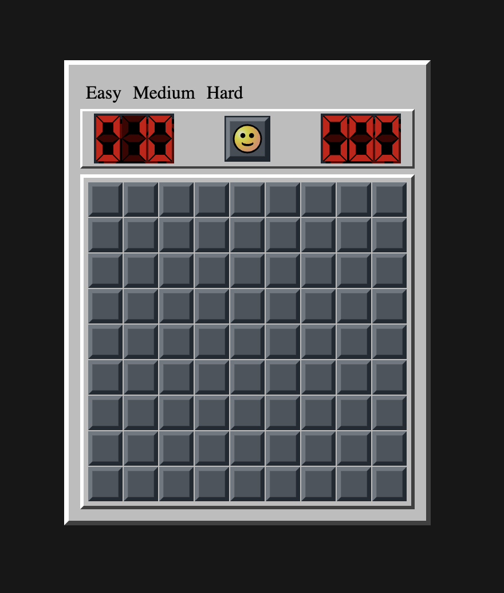

# 🧨 Campo Minado (Minesweeper) - Angular



> Um jogo clássico recriado com Angular 18, sinais e muito estilo retrô.  
> A classic game recreated using Angular 18, signals, and retro style.

---

## 🧩 Sobre o projeto | About the project

### 🇧🇷 Português  
Este é um jogo de Campo Minado feito com Angular, utilizando sinais (`signals`), componentes reativos e CSS puro para recriar o visual clássico do Windows 98.  
Você pode escolher entre três níveis de dificuldade: **Fácil**, **Médio** e **Difícil**.

### 🇺🇸 English  
This is a Minesweeper game built with Angular, using `signals`, reactive components and pure CSS to replicate the classic Windows 98 style.  
You can choose between three difficulty levels: **Easy**, **Medium**, and **Hard**.

---

## 📸 Screenshot


---

## 🚀 Como executar localmente | How to run locally

```bash
# Instale as dependências
npm install

# Inicie o servidor de desenvolvimento
ng serve
